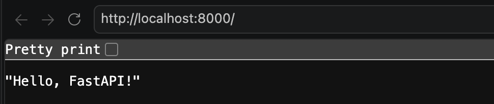

# Create First API

- Let's create our first API using FastAPI. We will create a simple API that returns a greeting message when accessed.

- Create a new file named `main.py` in your project directory and add the following code:

    ```python
    from fastapi import FastAPI

    app = FastAPI()

    @app.get("/")
    def greet():
        return "Hello, FastAPI!"
    ```

- In the above code, we have created an instance of the FastAPI class and defined a route `/` that returns a greeting message.

- When we access the root URL of our API, it will print the message **`Hello, FastAPI!`**.

- If you run `python main.py`, it will not work because we need to run the API using **Uvicorn**.

- To start the Uvicorn server, run the following command in your terminal:

    ```bash
    uvicorn main:app --reload
    ```

    | Option | Description |
    |--------|-------------|
    | `main` | The name of the Python file (without the `.py` extension) |
    | `app`  | The name of the FastAPI instance |
    

- Now, open your web browser and go to `http://localhost:8000/`. 

    

- Ok, let's perform CRUD operations with in-memory data. Starting with
    1. Get all products
    2. Get a product by ID
    3. Search for a product by name
    4. Create a new product
    5. Update an existing product
    6. Delete a product by ID
    7. Delete all products

- Go to [crud.py](../crud.py) to see the implementation of above operations.

- In FastAPI, you can set/return the status code of the response in two ways. Defining status code is optional.

    1. By using the `status_code` parameter in the route decorator. 

        ```python
        @app.post("/products", status_code=201)
        ```

    2. By using the `Response` object. You can set the status code conditionally based on the logic of your API.

        ```python
        from fastapi import Response

        @app.post("/products")
        def create_product(product: Product, response: Response):
            # Your logic to create a product
            response.status_code = 201
            return product
        ```

- You can use `HTTPException` to raise an error with a specific status code and detail message. For example, if a product is not found, you can raise a 404 error:

    ```python
    raise HTTPException(status_code=404, detail={"message": "Product not found"})
    ```

- Now, we have successfully created our first API using FastAPI. You can test the API endpoints using tools like Postman or directly from your browser for GET requests.

- Another way to test the API is by using the interactive API documentation provided by FastAPI. You can access it at `http://localhost:8000/docs`.


### Pydantic

- It is a data validation. Consider a scenario where you want to create a product.
- What if the user sends a request with an invalid product name or price? You need to validate the data before processing it.
- Pydantic is a library that helps you define data models and validate the data automatically.

```python
from pydantic import BaseModel, Field

class User(BaseModel):
    name: str = Field(..., min_length=1, max_length=50)
    age: int = Field(..., ge=0, le=100)
    email: str = Field(..., regex=r'^\S+@paypal.com$')
```

---

[⬅️ Previous: Setup Playground](docs/1.%20Setup%20Playground.md)  |  [➡️ Next: Working in Database](docs/3.%20Working%20in%20Database.md)